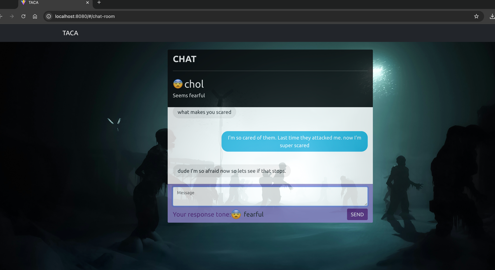
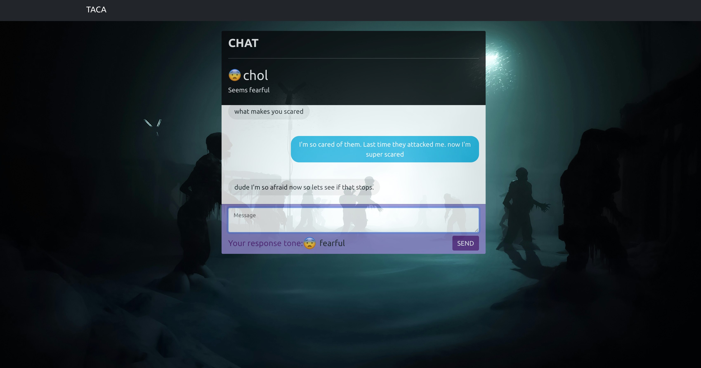

# 💬 TACA (Tone Aware Chat App)

TACA is a demo application that demonstrates Spring Websockets and IBM Watson Tone Analyzer. It enables two users to communicate via websockets while analyzing their emotional tone, creating a more empathetic chat experience.

## ✨ Features Overview

### 🤝 User Chat Experience

#### User 1 View (Regular Browser Window)


#### User 2 View (Incognito Window)


### 🎨 Dynamic Mood Backgrounds




## 🚀 Getting Started

### Joining Chat
- Rooms have unique random alphanumeric IDs
- System matches you with an available partner
- Room ID is securely communicated over HTTPS
- Websocket subscription is created for real-time chat

### Messaging Features
- Real-time tone analysis while typing
- Emotional states detected: angry, sad, joyful, disgusted, fearful, unknown
- Messages sent via websocket on Enter or button click
- Live mood indicators for both users

### Room Atmosphere
- Background changes every 30 seconds via Unsplash API
- Reflects overall room tone from last 10 messages
- Creates immersive, emotionally aware environment
### Testing Locally
1. Run the application:
```bash
./mvnw spring-boot:run
